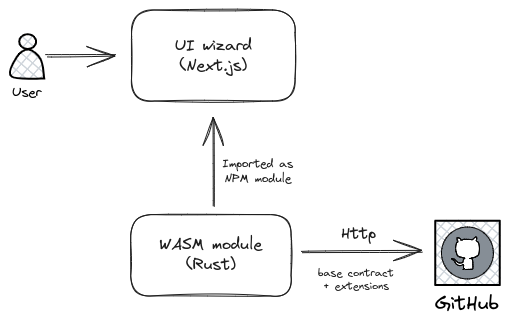

# General architecture

In order to have the app easily maintainable it is divided into 3 parts:

* Front-end with form and code preview
* Code generator [WebAssembly](https://webassembly.org/) module
* Public GitHub repository containing smart contract code fragments

The main purpose of the front-end app is to collect requirements from the user and present generated code. Entire logic related to the fetching code fragments as well ass generating final smart contract code is located in the wasm module.
Code generator is compiled to wasm binary and then is wrapped with typescript bindings. 
After that, package is pushed to the NPM as [ink-generator](https://www.npmjs.com/package/ink-generator)

Below is diagram representing general app architecture:

